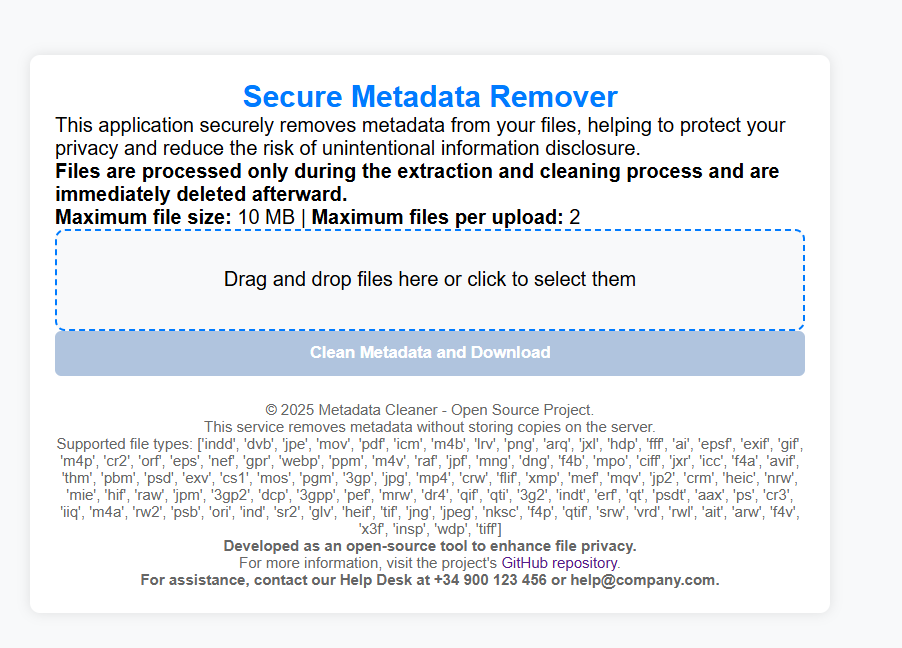

# Metadata Cleaner

## Version: 1.0  
**Author:** Javier Ripoll  
**Website:** [javierripoll.es](https://javierripoll.es)  
**Date:** 2025-02-14  

Metadata Cleaner is a Flask-based application that allows users to upload files, extract metadata, and remove metadata from supported file types using **ExifTool**.  

## 🚀 Features  
- Upload multiple files for metadata cleaning.  
- Supports a wide range of file types.  
- Uses ExifTool to remove metadata securely.  
- Web-based UI with drag-and-drop functionality.  
- Dockerized for easy deployment.  

---

## 🛠 Installation  

### **1️⃣ Clone the Repository**  
```bash
git clone https://github.com/yourusername/MetadataCleaner.git
cd MetadataCleaner
```

### **2️⃣ Install Dependencies**  
#### **Option 1: Run Locally (Python 3.9 Required)**
```bash
pip install -r requirements.txt
python app.py
```
The application will be accessible at **http://localhost:5000**

---

#### **Option 2: Run with Docker (Recommended)**
##### **Basic Usage**
```bash
docker build -t metadata-cleaner .
docker run -p 5000:5000 metadata-cleaner
```
This will run the application with the default settings.

##### **Run with Custom Configuration**  
You can override the default environment variables by passing them with `-e`:
```bash
docker run -p 5000:5000 \
    -e MAX_FILES=5 \
    -e MAX_FILE_SIZE_MB=100 \
    -e PAGE_TITLE="Custom Metadata Cleaner" \
    -e SUPPORT_MESSAGE="For support, contact support@example.com" \
    metadata-cleaner
```
Now, the application will:
- Allow up to **5 files** per upload.
- Accept files up to **100MB** in size.
- Display **"Custom Metadata Cleaner"** as the page title.
- Show the support message **"For support, contact support@example.com"**.

##### **Run in Detached Mode (`-d`)**
To keep the container running in the background:
```bash
docker run -d -p 5000:5000 metadata-cleaner
```

##### **Stop & Remove the Container**
Find the container ID and stop it:
```bash
docker ps  # List running containers
docker stop <container_id>
docker rm <container_id>
```

---

## 🔧 Environment Variables  

You can customize the application using the following environment variables:

| **Variable**         | **Default Value** | **Description** |
|----------------------|------------------|-----------------|
| `MAX_FILES`         | `10`             | Maximum number of files per upload. |
| `MAX_FILE_SIZE_MB`  | `50`             | Maximum file size (in MB) per upload. |
| `PAGE_TITLE`        | `"Metadata Cleaner"` | Title displayed on the UI. |
| `SUPPORT_MESSAGE`   | `"For support, please contact your IT Service or SATI."` | Custom support message for organizations. |

---

## 📸 Screenshot  

Here is a preview of the application:  

  

---

## 📂 Project Structure  

```
MetadataCleaner/
│── .dockerignore      # Files to ignore in Docker builds
│── app.py             # Main Flask application
│── Dockerfile         # Docker configuration
│── requirements.txt   # Python dependencies
│── templates/
│   └── upload.html    # Web UI template
│── screenshot.png     # (Optional) Screenshot for README
```

---

## 📜 License  
This project is open-source and available under the **MIT License**.

---

## 🙌 Contributions  
Pull requests are welcome! Feel free to fork the repo and submit your improvements.

---

## 📧 Contact  
For inquiries or support, please contact **[javier@javierripoll.es](mailto:javier@javierripoll.es)**.
